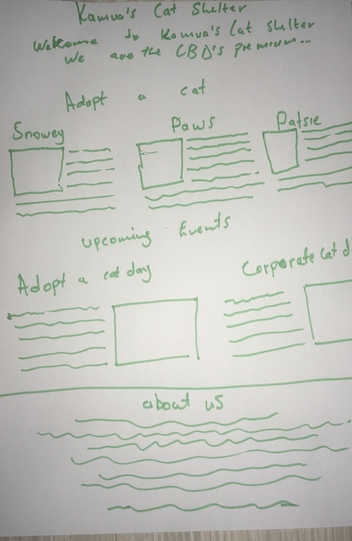

# Create a responsive landing page

Create a responsive landing page using the [`./index.html`](./index.html) file.

Ensure the landing looks like this for pages wider than 960px.

Use flexbox, floats or SimpleGrid to create the layout.

Add the appropriate container elements you might need to create the responsive landing page.

For smaller screens keep the default layout with all the text and images below each other. 

No other styling is required.

